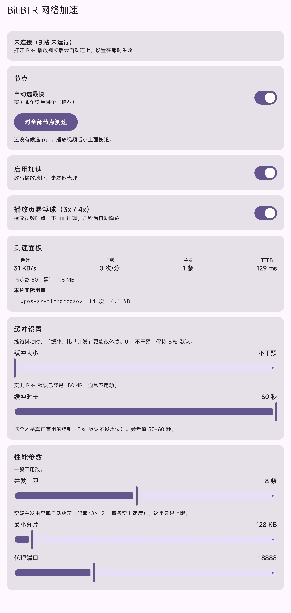

# BiliBTR

**An LSPosed module that accelerates video playback in the official Bilibili Android client.**
**为哔哩哔哩官方安卓客户端提供多 CDN 并发加速的 LSPosed 模块。**


-blue.svg)


[**English**](README.md) · [**中文**](README.zh-CN.md)

---

## Introduction

BiliBTR ports the *multi-CDN concurrent range download* strategy of
[Bilibili-thread-ripper](https://github.com/MrTangLuyao/Bilibili-thread-ripper)
to Android, targeting the **Bilibili client**.

It **cannot unlock any content**: it only routes the media byte requests issued by the
player through a local proxy, which **picks faster CDN nodes, downloads in parallel and
reads ahead**, then hands the bytes to the player — **optimising only the bytes the user
already has the right to access**.

> This project is built on **LSPosed API 102**.

## Features

### Networking

| Feature | Description |
| --- | --- |
| **Multi-CDN node selection** | Speed-tests the candidate nodes and uses the fastest one measured |
| **Concurrent connections** | Splits one range request into parallel segments; **concurrency adapts to the bitrate** (drops to 1 for low bitrates) |
| **Stream-as-you-fetch** | Returns data to the player as soon as upstream headers arrive, noticeably improving startup |
| **Read-ahead cache** | Prefetches ahead in the background so later requests hit memory directly |
| **Connection pooling** | Reuses upstream connections to the CDN, cutting per-request round-trip cost |
| **Graceful degradation** | Consecutive failures pause concurrency and fall back to a single connection, then recover automatically |

### Settings app

- **Speed panel** — live throughput, stall count, concurrency, TTFB, per-node usage
- **Node manager** — one-tap speed test of **all candidate nodes**, tap a node to pin it, or stay automatic
- **Buffer tuning** — manual **buffer size / buffer duration**
- **Floating speed ball** — **3x / 4x playback speed**, auto-hides when idle



## Requirements

| Item | Requirement |
| --- | --- |
| OS | Android 12 or newer (`minSdk 31`) |
| Framework | **LSPosed** (API 102) |
| Host app | Bilibili client (`tv.danmaku.bili`) (developed and verified on **9.8.0**) |

> The module does **not** request overlay permission.

## Installation

1. Download and install `app-release.apk` (or build it yourself, see below);
2. Open **LSPosed Manager** → Modules → enable **BiliBTR**;
3. **Tick the scope for Bilibili** (`tv.danmaku.bili`);
4. Open the **BiliBTR** app to configure.

## Usage

### Basics

1. Open BiliBTR and confirm it says "已连接 B站 进程" (Bilibili must be running);
2. Play any video;
3. Return to BiliBTR and check the **speed panel** for live data (throughput, nodes, stalls).

### Node management

- **Automatic** (on by default): the module continuously scores every node using **real
  download throughput** and switches to the fastest one automatically;
- **Manual**: tap "对全部节点测速" (test all nodes), wait for it to finish, then **tap any
  node** to pin it. Tap "取消锁定" or enable "自动选最快" to restore automatic mode;
- In the UI, "实际走" is the address the module actually uses, while "B站给的" is the
  address the client handed to the player.

### Buffer settings

- **Buffer size** maps to the player's `max-buffer-size`. Measured: Bilibili already
  defaults to **150 MB**;
- **Buffer duration** maps to the player's high/low watermarks — unset by default.
  For unstable links, **30–60 seconds** is recommended. `0` = leave untouched.

### Floating speed ball

While playing:

1. **Tap the screen** → three buttons `3x` `4x` `跟` appear on the right;
2. **Press and drag** it anywhere; it **auto-hides when idle**;
3. Tap `3x` / `4x` to force that speed; tap `跟` to restore Bilibili's own speed;
4. Turn the ball off in the app if you don't need it.

> Note: after forcing a speed, Bilibili's own UI **still shows the original value**.

## How it works

```
Bilibili client
      |  (1) media URL rewritten to http://127.0.0.1:18888/media?u=<original>
      v
  Local proxy (running inside Bilibili's process)
      |- candidates : upstream URLs U backup URLs U same-family host swaps
      |- selection  : real-traffic EWMA scoring + anchor priority + anti-flapping
      |- fetching   : adaptive concurrent range requests
      |- read-ahead : prefetch upcoming data into memory
      |- pooling    : keep-alive connection pool to the CDN
      |  (2) bytes returned to the player unchanged (standard 206 + Range)
      v
Bilibili player (IJK / ffmpeg)
```

The settings app and the Bilibili process communicate over **loopback TCP
(`127.0.0.1:18889`)**: the app pushes settings and reads speed-test data; the injected
side reports state.

> Why not an Android `ContentProvider`? Due to Android 11+ **package visibility**,
> Bilibili's process cannot see our provider (`Unknown authority`), whereas loopback TCP
> has no such restriction.

## Building from source

Requires JDK 17+ and the Android SDK (platform 37).

```bash
git clone <this-repo>
cd io.github.lwjlw.bilibtr
./gradlew :app:assembleRelease
# output: app/build/outputs/apk/release/app-release.apk
```

Install:

```bash
adb install -r app/build/outputs/apk/release/app-release.apk
```

## FAQ

**Q: The speed panel says "not connected".**
A: Bilibili isn't running. Play a video first, then return to BiliBTR.

**Q: Does it support other Bilibili versions?**
A: Developed and verified on **9.8.0**. Other versions may stop working — feel free to
open an issue.

**Q: Does it use more data?**
A: Read-ahead and concurrent fetching add a little traffic (prefetch + light probing);
overall usage is comparable to a direct connection.

## Contribution Statement

- The implementation was primarily written by DeepSeek Harness; requirements, design
  decisions and on-device acceptance were handled by the project owner.
- All key conclusions come from **real-device measurements**.
- Treat AI-generated code as **third-party code requiring review**; start with the
  scheduling and concurrency logic under `proxy/`.
- Issues and improvement suggestions are welcome.

## Acknowledgements

| Project | License | Note |
| --- | --- | --- |
| [Bilibili-thread-ripper](https://github.com/MrTangLuyao/Bilibili-thread-ripper) | MIT | The original project; its concurrent range downloading principle and default parameters are ported here |
| [PiliPlus (`btr` branch)](https://github.com/nishuodedui1145-del/PiliPlus) | GPL-3.0 | Its local-proxy architecture and some scheduling parameters were referenced |

BiliBTR is an independent implementation (Java / Kotlin) for the official client. It
contains no code from the projects above and is not a derivative work of them.
See [`NOTICE.md`](NOTICE.md) for full attributions.

## Disclaimer

- This project is **for learning and technical research only**. All APIs used were
  collected from official websites. It does not provide, modify, or unlock any paid or
  membership-only content.

## License

[GPL-3.0](LICENSE) © 2026 [lwjlw](https://github.com/lwjlw)

```
This program is free software: you can redistribute it and/or modify it under
the terms of the GNU General Public License as published by the Free Software
Foundation, either version 3 of the License, or (at your option) any later version.

This program is distributed in the hope that it will be useful, but WITHOUT ANY
WARRANTY; without even the implied warranty of MERCHANTABILITY or FITNESS FOR A
PARTICULAR PURPOSE.  See the GNU General Public License for more details.
```
